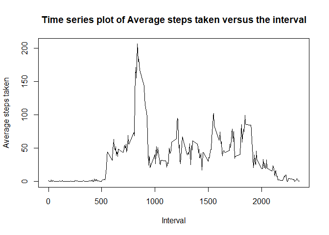

## Loading and preprocessing the data
The following was done to load and preprocess the data:

### 1. Loading the dataset
The tidyverse package `readr` is used to read the datset into a tbl_df

```r
library(readr)
hatd <- read_csv("activity.zip", na = "NA")
```

```
## Parsed with column specification:
## cols(
##   steps = col_double(),
##   date = col_date(format = ""),
##   interval = col_double()
## )
```

### 2. Preprocessing the dataset
We use a function from the `dplyr` package to group the dataset by dates on which observations were taken

```r
library(dplyr)
```

```
## 
## Attaching package: 'dplyr'
```

```
## The following objects are masked from 'package:stats':
## 
##     filter, lag
```

```
## The following objects are masked from 'package:base':
## 
##     intersect, setdiff, setequal, union
```

```r
by_date <- group_by(hatd, date)
```
Additionally, we would also like to group the dataset by the interval identifier

```r
by_interval <- group_by(hatd, interval)
```

## What is mean total number of steps taken per day?
### 1. Histogram of the total number of steps taken each day

First, we calculate the total number of steps per day

```r
total_steps_by_date <- summarise(by_date, total_steps = sum(steps))
```
Then, we plot it using `hist` from the base graphics package

```r
with(total_steps_by_date, hist(total_steps, xlab = "Total Steps taken per day", main = "Histogram of total steps taken per day"))
```

<!-- -->


### 2. Mean and Median total steps taken per day

Using `total_steps_by_date` from above, we calculate the mean and median total number of steps per day

```r
mean(total_steps_by_date$total_steps, na.rm = T)
```

```
## [1] 10766.19
```

```r
median(total_steps_by_date$total_steps, na.rm = T)
```

```
## [1] 10765
```
## What is the average daily activity pattern?

### 1. Time series plot of the 5-minute interval and number of steps in the interval averaged over all the days

We calculate the mean steps in each interval

```r
mean_steps_by_interval <- summarise(by_interval, mean_steps = mean(steps, na.rm = T))
```
and then we plot this using the `plot` from the base graphics package

```r
with(mean_steps_by_interval, plot(interval, mean_steps, 
                                  type = 'l',
                                  xlab = 'Interval',
                                  ylab = 'Average steps taken',
                                  main = 'Time series plot of Average steps taken versus the interval'))
```

<!-- -->

### 2. Interval of maximum activity

We find the interval with maximum number of steps using `order`

```r
with(mean_steps_by_interval,{
    step_order_desc <- order(-mean_steps)
    max_steps_interval <- interval[step_order_desc[1]]
    print(max_steps_interval)
})
```

```
## [1] 835
```
## Imputing missing values

### 1. Total Number of missing values in dataset

We find the total number of missing values in the dataset

```r
na_rows <- !complete.cases(hatd)
sum(na_rows)
```

```
## [1] 2304
```

### 2. Filling in for the NA's and the new dataset

We substitute missing steps values in the dataset for the mean steps in the same interval to produce a new dataset `hatd_wo_na`

```r
hatd_wo_na <- hatd
hatd_wo_na[na_rows, 'steps'] <- rep(x = mean_steps_by_interval$mean_steps, 
                                  times = nrow(hatd)/nrow(mean_steps_by_interval))[na_rows]
```
This code replaces the the missing values in the steps column of the original dataset with the corresponding value of average steps in that interval from a `rep`'d mean_steps column from mean_steps_by_interval

### 3. Plotting histograms and taking means of NA imputed data

We plot the histogram of total steps taken per day in the new dataset

```r
by_date_new <- hatd_wo_na %>% 
    group_by(date) %>%
    summarise(total_steps = sum(steps))

with(by_date_new,hist(total_steps, xlab = "Total Steps taken per day", main = "Histogram of total steps taken per day"))
```

<!-- -->

Now we calculate the mean and median steps taken per day for it.

```r
mean(by_date_new$total_steps)
```

```
## [1] 10766.19
```

```r
median(by_date_new$total_steps)    
```

```
## [1] 10766.19
```
We can see that the mean is unchanged, but the median has shifted forward and is equal to the mean now. This is probably since a lot of NA's were replaced by averages. Thus, the daily totals of days with NA step intervals, also shifted towards the mean daily total, and hence the median, which is the 50 percentile value, also shifted towards the mean and is now equal to the mean.


## Are there differences in activity patterns between weekdays and weekends?

### 1. Creating `day` factor with Levels: weekday weekend
We start this section by creating a factor variable to distinguish between weekdays and weekends

```r
day_type <- function(x){
    if(weekdays(x) %in% c("Saturday","Sunday")){
        return("weekend")
    }else{
        return("weekday")
    }
}

hatd_wo_na <- hatd_wo_na %>% 
    mutate(day = factor(sapply(date,day_type)))
```

### 2. Plotting average steps in an interval on weekends and weekdays

We start out by calculating the mean steps in each interval averaged over weekdays and weekends separately

```r
mean_steps_by_day <- hatd_wo_na %>% 
    group_by(day, interval) %>% 
    summarise(mean_steps = mean(steps))
```

Now to start the plotting:

```r
par(mfcol=c(2,1), mar=c(5,4,0,2))

with(filter(mean_steps_by_day, day == 'weekend'),
     plot(interval, mean_steps, 
          type='l',
          xlab = 'Interval',
          ylab = 'Number of steps',
          main = '')
)
mtext("Weekend", side = 4)

with(filter(mean_steps_by_day, day == 'weekday'),
     plot(interval, mean_steps, 
          type='l',
          xlab = 'Interval',
          ylab = 'Number of steps',
          main='')
)
mtext("Weekday", side = 4)
```

<!-- -->
